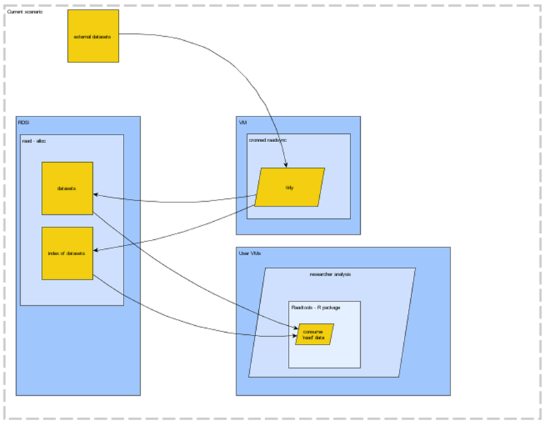
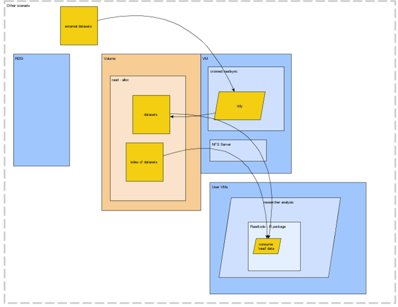
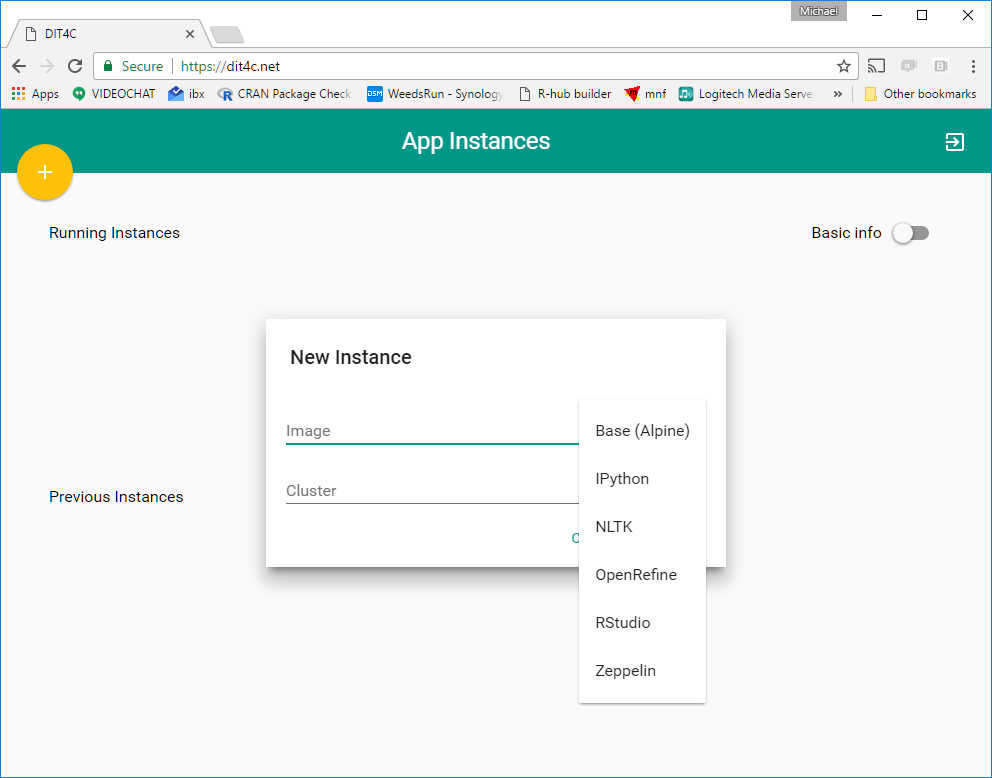
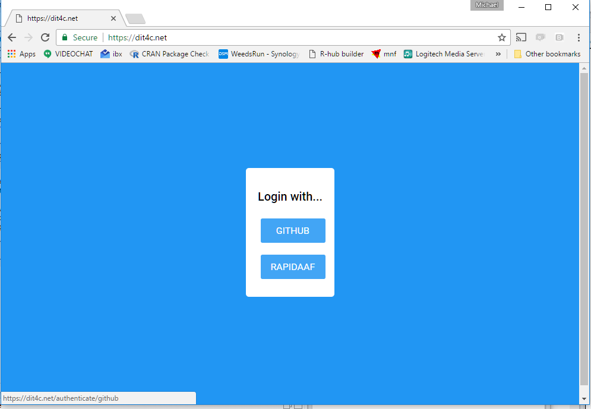

# Sharing data collections across ACE, AAD and IMOS 

* modellers need pre-processing of external data for input and post-processing, visualization and reporting
* models (e.g. ROMS, CMIP) and environmental data present challenging data volumes, data structures and granularity
* Ecosystem studies require simplified access to environmental data and model output
* general accessibility and interactivity and reporting is currently bespoke and sometimes challenging
* data collections are scattered, inconsistent, hard to share, and unnecessarily duplicated

# Objectives

The AAD/ACE ecosystems toolbox provides  easy access a substantial data library, used across multiple projects. This has matured into a modular system of **data source configuration**, **automated updates** and **downstream processing tools**. 

There are good apportunities to expand the usage of the data library itself, and the system that maintain it across our partners in ACE, IMAS, IMOS.  The system so far has scaled to dozens of users across a number of research cloud VMs, by providing direct network access to the bulk file collection. Direct access to the files is valuable because it scales very well, prototyping file access and test extractions have access to entire data sets, not just scattered and incomplete pieces. This encourages systematic software development and the ability to share software tools as services, rather than ad hoc script collections. 

We aim to consolidate shared access to these bulk data across a wide range of researchers. This will foster the development of service-based delivery of tools and reporting ...

# Opportunities for consolidation

A variety of tools are used by different individuals and groups for accessing data sets and there is a lot of overlap in requirements as well as reworking of similar or identical tasks. Many techniques used for spatial and temporal data are awkward or inefficient despite there being strong support for rich data representations in software packages

A clear common need is accessibility to bulk data collections, frequently individuals are tasked with obtaining files from particular sources and no over-arching system into which that work contributes. 

AAD and ACE have developed a data library and toolkit for R users that is widely used across ACE, IMAS, UTAS, AAD for ecosystem modelling, animal tracking studies, voyage planning and ship-data integration. The data library synchronization tools provide a general capacity to obtain external products and keep them up to date. 

The R data library is composed of two main R packages raadtools and raadsync, maintained by Michael Sumner and Ben Raymond. Imprtantly, the data library is built in a language-agnostic way, making no assumptions about downstream use. The synchronization tools are written in R but could also be deployed in other ways. 

The 'raadtools' package uses the data library, and this system could be set up for use in Python or any general programming language. The benefits of the data library are

* configuration is simple, specificy the address of the data source and the method to download
* synchronization is automatable, a cron job is set up to run the global "sync-library" function periodically 
* synchronization includes file name indexing, so downstream queries are efficient

At the ACE CRC and the AAD we have set up the system as follows. 
 
Bulk data storage is on the RDSI storage allocation project "RAAD". The Nectar project "raadsync" includes a server that stores the configuration for the bulk file storage and runs a scheduled task to regularly check for newly available and/or updated files. 
 
This file storage is made accessible to other compute machines via NFS, this has worked well for collaborations within the ecsosystem modelling groups but we need a solution to be able to share the data library more widely. 

# Problem 1: Disk storage for RAAD

Currently the data library is housed on RDS, and access to it is managed by TPAC. They provide explict permission to the TASResearch server to the RAAD project for a list of requested VM addresses. This is inefficient because the administrators of the RAAD clients cannot control the disk access, so there's a communication and admin overhead of getting the task executed on the TPAC side. It doesn't take long but it puts a barrier between "let's give you a VM" which provides the IP, and the "let's use the VM" while the TPAC config is carried out that particular IP.  This is illustrated here: 

 

# Solution: volume storage, with NFS server

It will be better to host the RAAD data-library on cloud volume, link the raadsync VM to that and operate it as an NFS server. Then client VMs can be configured by the raadsync administrators. 

# the raadsync data library

The raadsync system is used to build and synchronize the collection of environmental data files. Critically, the library is composed of individual data sets from external providers. These are identified by configuration in JSON, so that new data sets are easily added, and options can be controlled for a local deployment, i.e. to only synchronize certain collections, or to prioritize some data sets over others. 
 
This system can be deployed using cloud servers or locally on a single machine. The system aims to be platform-agnostic, and is supported on Windows by virtue of Unix system tools.  

# the raadtools toolbox

The raadtools package provides a high-level set of read functions for environmental data sets built upon the R Spatial extension packages that rely on standard libraries like PROJ.4, GDAL, and NetCDF4. 
 

# DIT4C
 
This is one-click VM launch from a curated VM pool. VMs will be configurable, added by docker recipe (probably). 

We need this to be able to link to the RAAD data-library, and to other network locations. 
 
 
 
 
 
